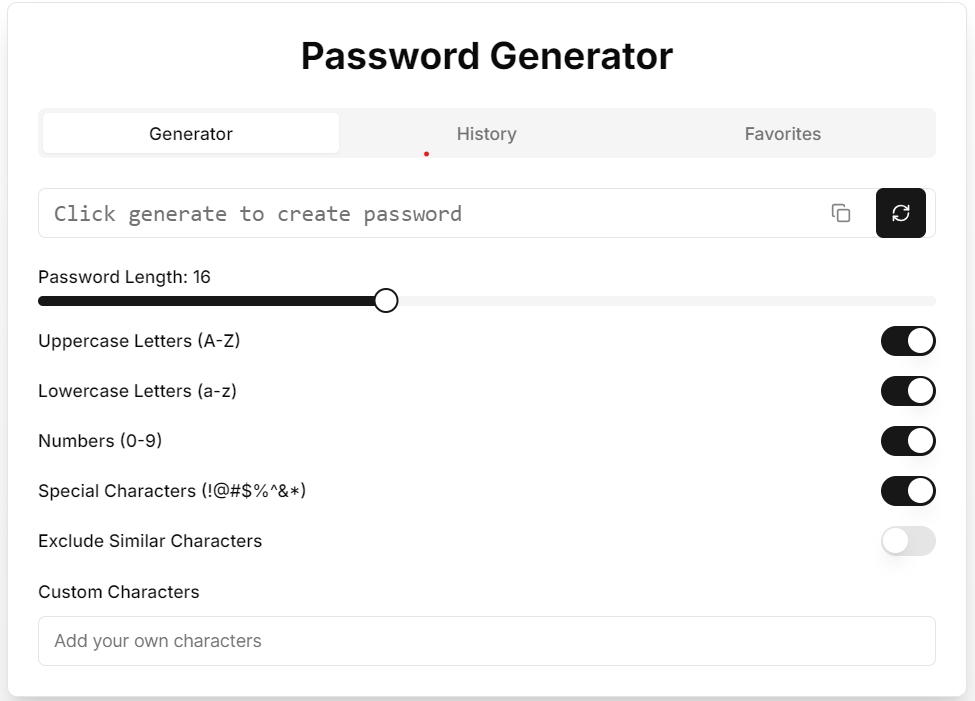

# Project Name

A modern web application built using **Next.js** (App Router), **React**, **TypeScript**, **Tailwind CSS**, and **PostCSS**.


## Project Overview
This project is a scalable and efficient web application that leverages **Next.js 13+'s App Router** for server-side rendering (SSR), static generation, and routing. **React** is used for building interactive UIs, and **TypeScript** is used for adding type safety, reducing errors, and improving maintainability. **Tailwind CSS** is used for styling, making the process fast and efficient.

## Tech Stack
- **Next.js**: Framework for server-side rendering and static site generation.
- **React**: JavaScript library for building UI components.
- **TypeScript**: Superset of JavaScript that adds static types.
- **Tailwind CSS**: Utility-first CSS framework for rapid UI development.
- **PostCSS**: Tool for transforming styles with plugins.
- **ESLint**: Linter for identifying and fixing code quality issues.

## Folder Structure
- **/app**: Contains the main application pages and layouts.
  - **globals.css**: Global styles for the application.
  - **layout.tsx**: Main layout file for the app.
  - **page.tsx**: The main page file for rendering content.
- **/components**: Reusable React components.
- **/hooks**: Custom React hooks for managing state or logic.
- **/lib**: Utility functions or shared logic.
- **/node_modules**: Project dependencies.
- **.eslintrc.json**: ESLint configuration file for linting.
- **tailwind.config.ts**: Tailwind CSS configuration.
- **postcss.config.js**: PostCSS configuration file.
- **tsconfig.json**: TypeScript configuration.
- **next.config.js**: Configuration file for Next.js.

## Getting Started
### Prerequisites
- **Node.js** (version 14 or newer)
- **npm** or **yarn** for package management

### Installation
1. **Clone the repository**:
   ```sh
   git clone https://github.com/RUPAMLAHA-code/PASSWORD-GENERATOR.git
   ```
2. **Navigate to the project folder**:
   ```sh
   cd PASSWORD-GENERATOR
   ```
3. **Install dependencies**:
   ```sh
   npm install
   # or
   yarn install
   ```

### Running the Project
To run the project locally in development mode:
```sh
npm run dev
# or
yarn dev
```
The application will be available at **http://localhost:3000**.

### Build for Production
To build the project for production:
```sh
npm run build
# or
yarn build
```
The output files will be in the `.next` directory.

### Linting
To check for any linting issues:
```sh
npm run lint
# or
yarn lint
```

## Features
- **Server-side rendering (SSR)** and **static site generation (SSG)**.
- **Modular components** for reusability.
- **TypeScript** for better type safety and reliability.
- **Custom hooks** to manage reusable logic.
- **Tailwind CSS** for rapid and responsive styling.

## Contributing
Feel free to open issues or submit pull requests for improvements. Contributions are welcome!

## License
This project is licensed under the MIT License.

